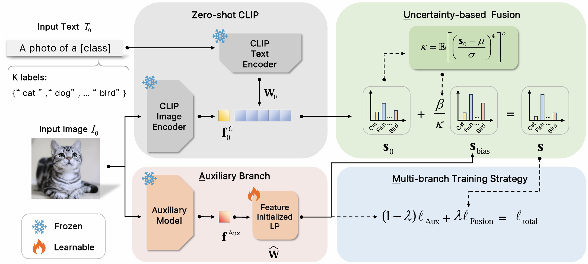
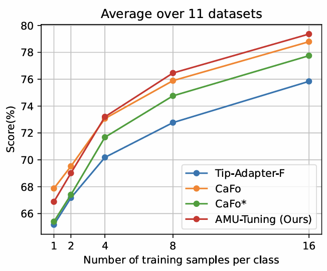

# AMU-Tuning: Effective Logit Bias for CLIP-based Few-shot Learning
- Official PyTorch implementation and pre-trained models for paper **AMU-Tuning: Effective Logit Bias for CLIP-based Few-shot Learning**.  
- AMU's version of MindSpore is available at [MindSpore-AMU](https://github.com/TJU-sjyj/MindSpore-AMU).
- The paper is accepted by ***CVPR 2024***.  🌟

## Introduction
This paper proposes a novel **AMU-Tuning** method to learn effective logit bias for CLIP-based few shot classification. Specifically, our AMU-Tuning predicts logit bias by exploiting the appropriate ***A***uxiliary features, which are fed into an efficient feature-initialized linear classifier with ***M***ulti-branch training. Finally, an ***U***ncertainty based fusion is developed to incorporate logit bias into CLIP for few-shot classification. The experiments are conducted on several widely used benchmarks, and the results show AMU-Tuning clearly outperforms its counterparts while achieving state-of-the-art performance of CLIP based few-shot learning without bells and whistles.  
<div align="center">
  
</div>

## Requirements
### Installation

Create a conda environment and install dependencies:
```bash
git clone https://github.com/TJU-sjyj/AMU-Tuning
cd AMU-Tuning

conda create -n AMU python=3.7
conda activate AMU

pip install -r requirements.txt

# Install the according versions of torch and torchvision
conda install pytorch torchvision cudatoolkit
```

### Dataset
Our dataset setup is primarily based on Tip-Adapter. Please follow [DATASET.md](https://github.com/gaopengcuhk/Tip-Adapter/blob/main/DATASET.md) to download official ImageNet and other 10 datasets.

### Foundation Models
* The pre-tained weights of **CLIP** will be automatically downloaded by running.
* The pre-tained weights of **MoCo-v3** can be download at [MoCo v3](https://github.com/facebookresearch/moco-v3).

## Get Started

### One-Line Command by Using `run.sh`

We provide `run.sh`  which you can run AMU-Tuning in an one-line command.
```bash
sh run.sh
```

### Arguments
- `clip_backbone` is the name of the backbone network of CLIP visual coders that will be used (e.g. RN50, RN101, ViT-B/16).  
- `lr` learning rate for adapter training.  
- `shots` number of samples per class used for training.  
- `alpha` is used to control the effect of logit bias.  
- `lambda_merge`  is a hyper-parameter in **Multi-branch Training**.  

More arguments can be referenced in [parse_args.py](https://github.com/TJU-sjyj/AMU-Tuning/parse_args.py).

### Training Example
You can use this command to train a **AMU adapter** with ViT-B-16 as CLIP's image encoder by 16-shot setting for 50 epochs.  

```bash
CUDA_VISIBLE_DEVICES=0 python train.py\
    --rand_seed 2 \
    --torch_rand_seed 1\
    --exp_name test_16_shot  \
    --clip_backbone "ViT-B-16" \
    --augment_epoch 1 \
    --alpha 0.5\
    --lambda_merge 0.35\
    --train_epoch 50\
    --lr 1e-3\
    --batch_size 8\
    --shots 16\
    --root_path /media/sdd/dataset/imagenet-1k/ILSVRC2012 \
    --load_aux_weight \
```

## Result
The average results over the 11 datasets are displayed in the following figure:
<div align="center">
  
</div>


The following table shows the results of AMU on the ImageNet1k dataset under the settings of 1~16 shots.
|Method           | Top1-Acc(%) | Checkpoint|
| --------- | ------- | -------------------------- |
| AMU-Tuning-MoCov3-ResNet50-16shot-lmageNet1k  | 70.02 |[Download]|
| AMU-Tuning-MoCov3-ResNet50-8shot-lmageNet1k   | 68.25 |[Download]|
| AMU-Tuning-MoCov3-ResNet50-4shot-lmageNet1k   | 65.92 |[Download]|
| AMU-Tuning-MoCov3-ResNet50-2shot-lmageNet1k   | 64.25 |[Download]|
| AMU-Tuning-MoCov3-ResNet50-1shot-lmageNet1k   | 62.60 |[Download]|


## Acknowledgement
This repo benefits from [Tip](https://github.com/gaopengcuhk/Tip-Adapter) and [CaFo](https://github.com/OpenGVLab/CaFo). Thanks for their works.❤️


## Contact
If you have any questions or suggestions, please feel free to contact us: tangyuwei@tju.edu.cn and linzhenyi@tju.edu.cn.

